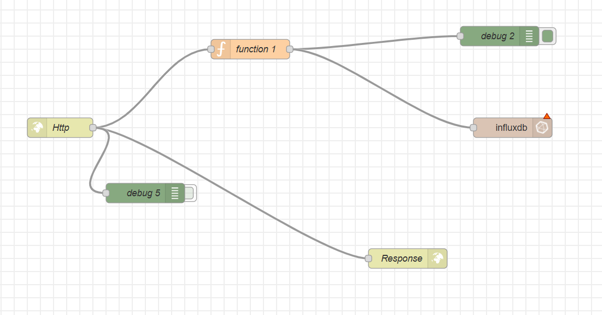
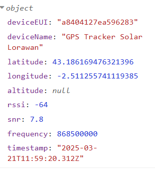
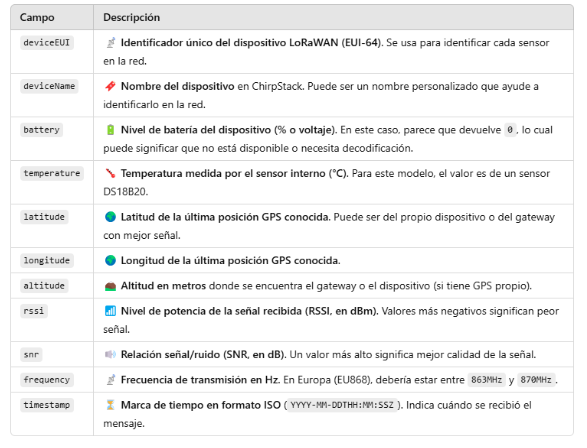
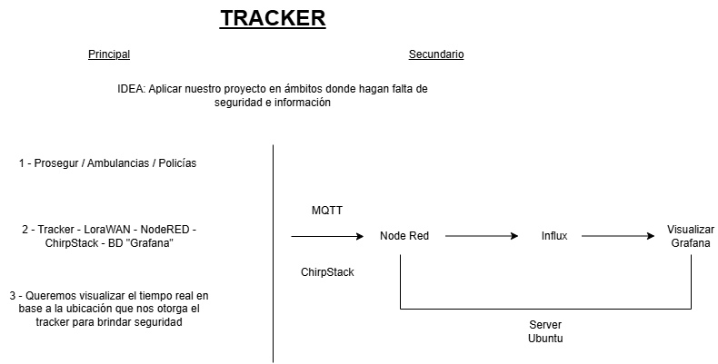

# Grupo 3
## Integrantes
- Jon Telleria
- Joel Sierra
- Josu Alvarez
- Aner García
- Ander Azpiazu

## Descripción del Proyecto
[Breve descripción del proyecto que desarrollarán]

## Estructura
- `Chirpstack/`: 

- `Aplicacion/`: 

HTTP: API-ari POST deia egiteko balio du, datuak lortzeko CHIRPSTACK
FUNCTION-ak zuk nahi dituzun datuak bakarrik jasotzeko balio du
RESPONSE API-a funtzionamenduan dagoela jakiteko balio du.
INFLUX: datuak datubasera sartzeko.

## Instrucciones de Instalación
[Instrucciones específicas de instalación]

## Uso
[Instrucciones de uso] 